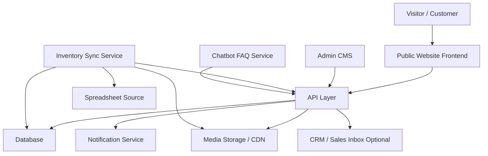

# Luxury Automobile Showroom Website — Architecture Document

## 1. Project Overview

This project is a high-end, informational website for a luxury automobile showroom/reseller in Dubai.

The website will:

- Showcase vehicle inventory in a premium visual format
- Provide search, filtering, and brand-based browsing
- Generate qualified sales leads through enquiry, callback, booking, and sell-your-car forms
- Allow non-technical showroom staff to manage inventory and FAQs without code changes
- Automatically synchronize vehicle inventory from a spreadsheet source
- Include a rule-based FAQ chatbot with no LLM/generative AI
- Deliver strong SEO, performance, and mobile responsiveness

This project is explicitly **not**:

- An e-commerce checkout platform
- A payment processing system
- A user account/customer login portal
- A clone of the reference website’s design, assets, or code

---

## 2. Core Objectives

1. Present vehicle inventory in a premium, fast, and visually rich format
2. Enable no-code inventory management for showroom staff
3. Keep website inventory automatically synchronized with the showroom’s source spreadsheet
4. Capture and store sales leads reliably
5. Provide a controlled rule-based FAQ chatbot
6. Achieve strong SEO and Core Web Vitals performance

---

## 3. High-Level Architecture

---

## 4. System Components

### 4.1 Public Website

Responsibilities:

- Homepage
- Inventory browsing
- Vehicle detail pages
- Brand pages
- About, Contact, FAQ, and Location pages
- Lead capture forms
- Sell-your-car submission
- Chatbot widget
- SEO and structured data

Recommended technology:

- Next.js App Router
- React Server Components
- SSR/ISR for SEO and performance
- Tailwind CSS or custom premium design system
- Next/Image with CDN optimization

---

### 4.2 Admin CMS / Backoffice

A secure admin interface for non-technical staff to manage:

- Vehicles
- Images
- Pricing
- Specifications
- Featured vehicles
- FAQ categories/questions/answers
- Leads
- Site settings
- Sync logs/status

Recommended options:

- Payload CMS
- Directus
- Strapi

Preferred recommendation:

- Next.js + Payload CMS + PostgreSQL

Why:

- Single codebase
- Strong TypeScript support
- Customizable admin UI
- Self-hostable
- Good fit for structured content such as vehicles, FAQs, and leads

---

### 4.3 Database

Stores:

- Vehicle inventory
- Leads
- FAQ content
- Admin users/roles
- Sync logs
- Settings
- Optional blog/media metadata

Recommended technology:

- PostgreSQL

Why:

- Reliable relational data model
- Strong filtering/search support
- Good fit for structured inventory data
- Easy to scale for several hundred vehicles

---

### 4.4 Media Storage

Stores:

- Vehicle images
- Blog/media images
- Optional sell-your-car submitted images

Recommended technology:

- Cloudinary
- or AWS S3 + CloudFront
- or Supabase Storage

Recommended:

- Cloudinary for image transformation, optimization, and CDN delivery

---

### 4.5 Inventory Sync Service

A background/service layer that:

- Reads inventory from Google Sheets or Excel
- Validates rows
- Inserts/updates/deactivates vehicles
- Downloads/registers images
- Logs sync results
- Prevents malformed rows from breaking the live site

Recommended implementation:

- Node.js worker/service
- Scheduled via cron
- Can run as standalone worker, scheduled API route, or queue-based job

Suggested tools:

- Google Sheets API
- Excel parsing library
- Zod or Yup for validation
- Vercel Cron, GitHub Actions schedule, Node cron worker, or BullMQ + Redis

---

### 4.6 Lead Capture & Notification Layer

Handles:

- Booking requests
- Callback requests
- General enquiries
- Sell-your-car submissions

Responsibilities:

- Validate input
- Store lead in database
- Notify sales team
- Optionally push to CRM
- Track lead status

Recommended tools:

- Resend / SendGrid / SES
- Optional CRM webhook: HubSpot, Zoho, Salesforce
- WhatsApp deep link integration

---

### 4.7 Rule-Based Chatbot

A non-LLM chatbot that:

- Presents categories/buttons
- Provides predefined answers
- Optionally matches typed keywords to scripted answers
- Falls back to human contact when needed

Characteristics:

- No generative AI
- No fabricated answers
- Content fully editable from CMS
- Mobile-friendly
- Matches luxury UI styling

---

## 5. Recommended Technology Stack

| Layer | Recommended Choice | Reason |
|---|---|---|
| Frontend | Next.js | SEO, SSR/ISR, performance, premium UX |
| Styling | Tailwind CSS | Fast premium responsive UI |
| CMS/Admin | Payload CMS or Directus | No-code management for staff |
| Database | PostgreSQL | Structured, reliable, scalable |
| Media | Cloudinary or S3 + CDN | Optimized images and performance |
| Auth | CMS native auth / NextAuth | Secure admin access |
| Sync | Node worker + cron | Automated spreadsheet import |
| Email | Resend / SendGrid | Lead notifications |
| Search/Filtering | PostgreSQL indexes + query layer | Fast enough for several hundred vehicles |
| Optional Search Engine | Meilisearch / Typesense | If instant faceted search is desired |
| Monitoring | Sentry + analytics | Error tracking and insights |
| Hosting | Vercel + managed DB, or AWS/DigitalOcean | Flexible deployment options |

---

## 6. Proposed Architecture Pattern

Recommended pattern:

Headless CMS + Server-Rendered Next.js Frontend + Sync Worker

This gives:

- Premium frontend experience
- SEO-friendly server rendering
- No-code content management
- Independent automated sync process
- Easy future scalability

---

## 7. Data Model

### 7.1 Vehicle

Fields:

- id
- stockNumber / vin
- slug
- make
- model
- trim
- year
- price
- currency
- status
- bodyType
- mileage
- engine
- cylinders
- transmission
- drivetrain
- fuelType
- exteriorColor
- interiorColor
- doors
- seats
- description
- features[]
- images[]
- isFeatured
- seoTitle
- seoDescription
- sourceRowId
- syncedAt
- createdAt
- updatedAt

Status values:

- available
- reserved
- sold
- coming_soon
- hidden

---

### 7.2 Lead

Fields:

- id
- type
- name
- phone
- email
- message
- vehicleId
- preferredContactTime
- sourcePage
- status
- consent
- createdAt

Lead types:

- booking
- callback
- enquiry
- sell_your_car

Lead statuses:

- new
- contacted
- qualified
- closed
- spam

---

### 7.3 Sell Your Car Submission

Fields:

- id
- name
- phone
- email
- make
- model
- year
- mileage
- condition
- expectedPrice
- notes
- images[]
- status
- createdAt

---

### 7.4 FAQ Category

Fields:

- id
- title
- slug
- sortOrder
- isActive

---

### 7.5 FAQ Item

Fields:

- id
- categoryId
- question
- answer
- keywords[]
- sortOrder
- isActive

---

### 7.6 Site Settings

Fields:

- showroomName
- address
- phone
- whatsappNumber
- email
- openingHours
- mapEmbedUrl
- socialLinks
- heroBanner
- featuredVehicleSelectionRules

---

### 7.7 Sync Log

Fields:

- id
- startedAt
- completedAt
- status
- totalRows
- added
- updated
- removed
- skipped
- errors[]
- triggeredBy

---

### 7.8 Admin User

Fields:

- id
- name
- email
- role
- isActive

Roles:

- admin
- inventory_manager
- sales
- content_editor

---

## 8. Key User Flows

### 8.1 Customer Browsing Flow

1. Visitor lands on homepage
2. Views featured vehicles
3. Uses quick search by make/model/year
4. Browses inventory or brand pages
5. Opens vehicle detail page
6. Views gallery, specs, price, description
7. Makes enquiry / requests callback / books viewing / contacts via WhatsApp

---

### 8.2 Inventory Management Flow

1. Staff logs into CMS admin
2. Adds or edits vehicle
3. Uploads images
4. Enters specifications and pricing
5. Marks vehicle as featured/available/sold
6. Saves/publishes
7. Frontend updates via SSR/ISR revalidation

---

### 8.3 Spreadsheet Sync Flow

1. Sync service fetches latest sheet data
2. Rows are validated
3. Valid rows are inserted or updated
4. Missing rows are marked sold/hidden based on configuration
5. Images are validated or stored
6. Affected pages are revalidated
7. Sync logs are stored

---

### 8.4 Lead Capture Flow

1. Customer submits form
2. Backend validates data
3. Lead saved to database
4. Email notification sent to sales team
5. Optional CRM webhook triggered
6. Admin can view/update lead status in CMS

---

### 8.5 Chatbot Flow

1. User opens chatbot
2. Chooses category or types question
3. System matches scripted FAQ answer
4. If no match, fallback shown:
   - WhatsApp
   - callback request
   - enquiry form

---

## 9. Inventory Sync Architecture

### 9.1 Source Formats Supported

- Google Sheets
- Excel upload

### 9.2 Sync Modes

- Scheduled sync
- Manual sync from admin panel
- Optional webhook-based sync

### 9.3 Matching Strategy

Use a stable unique identifier:

- stockNumber
- or VIN
- or sourceRowId

This is required to distinguish between update vs insert.

---

### 9.4 Validation Rules

Required fields:

- Make
- Model
- Year
- Price
- Status
- At least one image

Validation checks:

- Year must be valid numeric range
- Price must be numeric
- Image URLs must be valid
- Status must match allowed values
- Duplicate stock numbers handled safely

---

### 9.5 Error Handling

- Invalid rows are skipped, not allowed to break site
- Error log stores row number and reason
- Previous valid vehicle data remains live
- Admin dashboard shows sync failures
- Optional email alert on repeated sync failure

---

### 9.6 Deletion / Removal Logic

Recommended behavior:

- Do not hard delete immediately by default
- If a row disappears from source:
  - mark as sold or hidden

Configurable options:

- Mark missing rows as sold
- Mark missing rows as hidden
- Hard delete only if explicitly required

---

## 10. Search and Filtering Architecture

### 10.1 Filters

- Make
- Model
- Year range
- Price range
- Body type
- Transmission
- Fuel type
- Drivetrain
- Availability
- Featured only

### 10.2 Implementation

For several hundred vehicles:

- PostgreSQL with indexed fields is sufficient
- Use pagination or infinite scroll
- Use server-side filtering

### 10.3 Optional Upgrade

If instant search is a priority:

- Meilisearch or Typesense
- Sync vehicles into search index after update

---

## 11. SEO Architecture

### 11.1 Page Strategy

- Server-rendered vehicle pages
- Clean URLs
- Brand landing pages
- Sitemap generation
- Canonical tags
- Meta title/description per page
- Open Graph tags

### 11.2 Structured Data

Use schema.org markup:

- Car
- Offer
- AutoDealer
- FAQPage
- BreadcrumbList

### 11.3 Technical SEO

- sitemap.xml
- robots.txt
- Redirect handling for removed vehicles
- 301 redirects for changed slugs
- Fast Core Web Vitals

---

## 12. Performance Architecture

### 12.1 Targets

- LCP < 2.5s
- CLS < 0.1
- INP < 200ms

### 12.2 Optimization Techniques

- Image optimization via CDN
- AVIF/WebP formats
- Lazy loading below-the-fold images
- Preloading hero media where appropriate
- ISR for vehicle/brand pages
- API caching
- Pagination instead of loading all inventory
- Minimal client-side JavaScript

---

## 13. Security Architecture

### 13.1 Authentication & Authorization

- Admin login required
- Role-based access control

### 13.2 Data Protection

- Environment secrets not exposed
- CSRF protection
- Input validation
- Rate limiting on forms
- Secure file upload handling
- PII stored only as needed

### 13.3 Auditability

- Track created/updated records
- Store sync logs
- Store lead status changes

---

## 14. Notification Architecture

### 14.1 Lead Notifications

When a lead is created:

- Save to database
- Send email to sales team
- Optional SMS/WhatsApp alert
- Optional CRM push

### 14.2 Sync Failure Alerts

If sync fails:

- Email admin/technical contact
- Show failure in dashboard

---

## 15. Chatbot Architecture

### 15.1 Core Approach

Rule-based only:

- menu-driven categories
- pre-written answers
- keyword matching optional
- no LLM

### 15.2 Data Source

FAQ entries managed in CMS

### 15.3 Matching Logic

Simple scoring model:

- normalize text
- match keywords
- match question terms
- return best scripted answer
- if confidence below threshold, fallback to human contact

### 15.4 Fallback Options

- WhatsApp quick contact
- callback request
- enquiry form

---

## 16. Environments

### 16.1 Development

- Local database
- Mock/sample inventory
- Local media storage or sandbox cloud storage

### 16.2 Staging

- Full CMS
- Sync with test spreadsheet
- Lead notification test mode

### 16.3 Production

- Live inventory sync
- Real notifications
- SEO enabled
- Analytics enabled

---

## 17. Deployment Architecture

### Option A: Managed Modern Stack

- Frontend/CMS: Vercel
- Database: Neon / Supabase Postgres
- Media: Cloudinary
- Cron: Vercel Cron / QStash
- Email: Resend

### Option B: Self-Hosted / Cloud VM

- Next.js + CMS on Docker
- PostgreSQL
- Nginx
- Redis for queue if needed
- S3-compatible storage
- Cron job on server

Recommended for simplicity:

- Vercel + Managed Postgres + Cloudinary + Cron service

---

## 18. Testing Strategy

### 18.1 Unit Tests

- Validation logic
- Sync mapping logic
- Chatbot keyword matching logic

### 18.2 Integration Tests

- Lead creation
- Inventory sync
- Admin CRUD operations

### 18.3 End-to-End Tests

- Homepage to vehicle page journey
- Search/filter flow
- Enquiry submission
- Admin vehicle publish flow

### 18.4 Performance Tests

- Lighthouse CI
- Load testing for inventory listing page
- Image delivery audit

---

## 19. Observability

Recommended:

- Error tracking: Sentry
- Logs: structured server logs
- Sync logs in admin
- Analytics: GA4 or privacy-friendly alternative
- Uptime monitoring

---

## 20. Architecture Decisions

### Decision 1: Headless CMS instead of WordPress

Why:

- Better performance
- More control over premium UI
- Cleaner separation of frontend and content
- Better API-first support

### Decision 2: PostgreSQL instead of NoSQL

Why:

- Inventory is structured
- Filtering/searching benefits from relational model
- Easier reporting and lead management

### Decision 3: Rule-based chatbot only

Why:

- Requirement explicitly forbids LLM
- Guarantees controlled answers
- Easier to maintain and audit

### Decision 4: Soft delete vehicles

Why:

- Protects SEO
- Avoids broken links
- Keeps historical data for reporting

---

## 21. Future Extensibility

Possible future additions:

- Multilingual Arabic/English support
- Advanced search facets
- Comparison tool
- Finance calculator informational only
- WhatsApp Business API integration
- Inventory export to marketplaces
- Appointment calendar integration